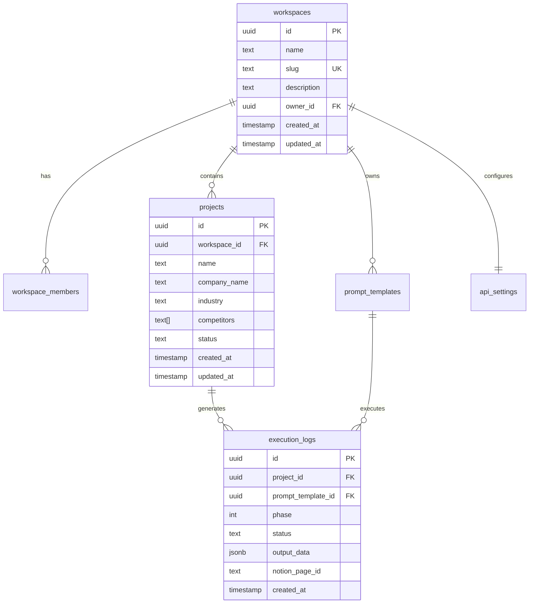
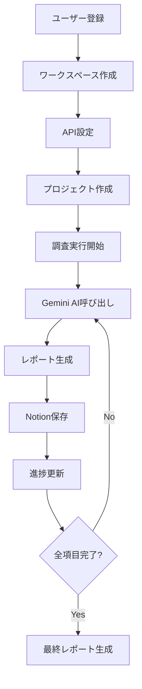

# 📊 Business Strategy Automation

**事業戦略自動化システム** - Gemini AIを活用した包括的な事業戦略策定プラットフォーム

[](https://nextjs.org/)
[](https://www.typescriptlang.org/)
[](https://supabase.com/)
[](https://tailwindcss.com/)

## 🎯 概要

Business Strategy Automationは、**38項目にわたる体系的な事業戦略調査を完全自動化**するプラットフォームです。マッキンゼー品質のコンサルティングフレームワークをベースに、**Gemini AI**が高品質な戦略レポートを自動生成し、**Notion**に整理して保存します。

### ✨ 主な特徴

- **🤖 完全自動化**: 設定後は38項目の調査が自動実行される
- **👥 チーム対応**: ワークスペース機能でチーム全体で利用可能
- **📝 カスタマイズ**: プロンプトの編集・追加が可能
- **📊 進捗管理**: リアルタイムでの実行状況確認
- **📋 Notion連携**: 結果を自動的にNotionに整理・保存
- **🔄 段階実行**: 3フェーズに分けた詳細な分析
- **📈 エビデンス重視**: 全ての分析に出典とエビデンスを付記
- **🔐 セキュア**: Row Level Security (RLS)による安全なデータ管理

## 🏗️ システム構成

### フェーズ別調査項目（計38項目）

#### 📍 フェーズⅠ：現状把握と事業基盤（6項目）
1. **内部環境・自社アセット評価レポート** - VRIOフレームワークによる競争優位性分析
2. **ビジネスモデル診断と再構築プラン** - ビジネスモデルキャンバスによる現状分析と改善案
3. **市場規模・成長性分析レポート** - 市場機会の定量的評価
4. **PESTLE分析とマクロ環境機会レポート** - 政治・経済・社会・技術・法的・環境要因の分析
5. **競合インテリジェンス・スイッチング要因分析** - 競合他社の戦略と顧客の乗り換え要因
6. **テクノロジートレンド・セキュリティ機会分析** - 技術動向と事業機会の発見

#### 🎯 フェーズⅡ：顧客理解と戦略の核（5項目）
7. **顧客セグメンテーション・ペルソナ定義** - データドリブンな顧客分析
8. **顧客インサイト・メッセージング戦略** - 深層心理に基づく訴求戦略
9. **カスタマージャーニー・体験マッピング** - 顧客体験の可視化と改善点特定
10. **プロダクト仮説検証プロセス設計** - リーン・スタートアップ手法の適用
11. **ブランド・アイデンティティ戦略の策定** - 差別化されたブランド構築

#### 🚀 フェーズⅢ：市場参入と成長戦略（6項目）
12. **Go-to-Market戦略・セールスプラン** - 市場参入の具体的戦術
13. **パートナーシップ・エコシステム戦略** - 戦略的提携の設計
14. **グローバル展開・ローカライゼーション戦略** - 海外市場参入計画
15. **成長ドライバー・リテンション改善戦略** - 持続的成長の仕組み構築
16. **ユニットエコノミクス（LTV/CAC）分析** - 収益性の定量的評価
17. **フリーミアム戦略の導入計画** - 段階的な収益化モデル

#### 📢 フェーズⅣ：マーケティング・コミュニケーション（11項目）
18. **コンテンツ＆チャネル戦略の策定** - 統合的なコンテンツマーケティング
19. **クリエイティブ改善・学習プロセス構築** - A/Bテストとデータ分析
20. **広報・PR戦略** - メディアリレーションとブランド認知向上
21. **広告メディアプランニング** - ROI最適化された広告戦略
22. **YouTube運用戦略** - 動画コンテンツによるエンゲージメント向上
23. **Instagram運用戦略** - ビジュアルコンテンツでのブランディング
24. **X(Twitter)運用戦略** - リアルタイムコミュニケーション戦略
25. **TikTok運用戦略** - 若年層向けショートコンテンツ戦略
26. **アフィリエイト・マーケティング戦略** - パートナー経由の集客拡大
27. **インフルエンサーマーケティング戦略** - 影響力のあるクリエイターとの協業
28. **ポストセールス・コミュニティ戦略** - 顧客ロイヤルティ向上

#### 🏢 フェーズⅤ：事業推進基盤とリスク管理（9項目）
29. **マーケティングテクノロジー基盤設計** - MarTechスタックの最適化
30. **セールス・イネーブルメント体制の構築** - 営業組織の効率化
31. **KPI設計とモニタリングダッシュボード構築** - データドリブン経営の実現
32. **戦略的人員・予算計画の策定** - リソース配分の最適化
33. **データ駆動型意思決定プロセスの導入** - 分析基盤の構築
34. **「学習する組織」への変革プラン** - 継続的改善文化の醸成
35. **ESG・サステナビリティ戦略策定** - 持続可能な事業モデル
36. **事業リスク・シナリオプランニング** - 不確実性への対応策
37. **クライシス・マネジメント・プレイブック** - 危機管理体制の構築

#### 📋 最終成果物
38. **事業戦略 全体サマリーレポート** - 全分析を統合した包括的戦略書

## 🛠️ 技術スタック

### フロントエンド・バックエンド
- **Next.js 14** (App Router) - フルスタックWebアプリケーション
- **TypeScript** - 型安全性とコード品質向上
- **Tailwind CSS** - ユーティリティファーストなスタイリング
- **shadcn/ui** - 高品質なUIコンポーネントライブラリ
- **React Hook Form** - フォーム管理とバリデーション
- **Zod** - TypeScript-firstなスキーマバリデーション

### データベース・認証
- **Supabase** - PostgreSQLデータベース + 認証サービス
- **Row Level Security (RLS)** - セキュアなデータアクセス制御
- **Real-time subscriptions** - リアルタイムデータ更新

### AI・外部API
- **Google Gemini AI** - 高品質な戦略レポート生成
- **Notion API** - 結果の自動整理・保存

### デプロイ・インフラ
- **Vercel** - ワンクリックデプロイとホスティング
- **GitHub** - ソースコード管理とCI/CD

## 🚀 セットアップ手順

### 1. 前提条件

以下のアカウントとAPIキーが必要です：
- [Supabase](https://supabase.com) プロジェクト
- [Google AI Studio](https://aistudio.google.com/) APIキー
- [Notion](https://developers.notion.com/) インテグレーション（オプション）

### 2. リポジトリのクローン

```bash
git clone https://github.com/your-username/business-strategy-automation.git
cd business-strategy-automation
```

### 3. 依存関係のインストール

```bash
npm install
# または
yarn install
# または
pnpm install
```

### 4. 環境変数の設定

`.env.example`をコピーして`.env.local`を作成：

```bash
cp .env.example .env.local
```

必要な環境変数を設定：

```env
# Supabase設定
NEXT_PUBLIC_SUPABASE_URL=your_supabase_url
NEXT_PUBLIC_SUPABASE_ANON_KEY=your_supabase_anon_key
SUPABASE_SERVICE_ROLE_KEY=your_supabase_service_role_key

# Gemini API設定
GEMINI_API_KEY=your_gemini_api_key

# Notion API設定（オプション）
NOTION_API_TOKEN=your_notion_token

# Next.js設定
NEXTAUTH_URL=http://localhost:3000
NEXTAUTH_SECRET=your_nextauth_secret

# 開発環境設定
NODE_ENV=development
```

### 5. Supabaseプロジェクトの設定

1. [Supabase](https://supabase.com)でプロジェクト作成
2. SQLエディタで以下のマイグレーションを順番に実行：
   ```sql
   -- データベーススキーマを作成
   \i supabase/migrations/001_initial_schema.sql
   
   -- 初期プロンプトデータを挿入
   \i supabase/migrations/002_insert_initial_prompts.sql
   ```

### 6. 開発サーバーの起動

```bash
npm run dev
```

ブラウザで [http://localhost:3000](http://localhost:3000) を開く

## 📖 使い方

### 初回セットアップ

1. **アカウント作成**: メールアドレスまたはGoogleアカウントでサインアップ
2. **ワークスペース作成**: チーム用のワークスペースを設定
3. **API設定**: システム設定でGeminiとNotionのAPIキーを設定

### プロジェクト作成

1. ダッシュボードで「**新規プロジェクト**」をクリック
2. 企業情報を入力：
   - 企業名、業界、主要製品・サービス
   - ターゲット市場、競合企業
   - 予算規模

### 調査実行

#### 手動実行
- 特定の項目を選択して個別実行
- フェーズごとの段階的実行

#### 自動実行（推奨）
- 全38項目を自動実行
- 実行間隔とエラー処理を設定可能
- バックグラウンドでの連続実行

### 結果確認

- **ダッシュボード**: 進捗状況をリアルタイム表示
- **Notion**: 自動作成されたページで詳細確認
- **履歴**: 過去の実行結果を時系列で表示

## 🔧 API設定ガイド

### Gemini AI API

1. [Google AI Studio](https://aistudio.google.com/)でAPIキー取得
2. システム設定画面でAPIキーを入力
3. 利用制限に注意：
   - **無料枠**: 15 requests/minute, 1,500 requests/day
   - **有料プラン**: [Google AI Pricing](https://ai.google.dev/pricing)

### Notion API（オプション）

1. [Notion Developers](https://developers.notion.com/)でインテグレーション作成
2. 結果保存用のデータベースを作成
3. データベースIDをシステム設定で入力

## 🌐 デプロイ手順

### Vercelデプロイ（推奨）

1. GitHubにリポジトリをプッシュ
2. [Vercel](https://vercel.com)でプロジェクトをインポート
3. 環境変数を設定
4. デプロイ完了

[](https://vercel.com/new/clone?repository-url=https://github.com/your-username/business-strategy-automation)

### 手動デプロイ

```bash
npm run build
npm start
```

## 📊 アーキテクチャ

### データベース設計



### システムフロー



## 🔐 セキュリティ

- **Row Level Security**: Supabaseで実装済み
- **API Key管理**: 環境変数で安全に管理
- **チーム分離**: ワークスペース単位でデータ分離
- **認証**: Supabase Authで安全なユーザー管理
- **HTTPS**: 全通信の暗号化

## 📈 料金・制限

### システム利用料金
- **基本機能**: 無料
- **制限**: 使用するAPIサービスの制限に依存

### 外部サービス料金

#### Gemini AI
- **無料枠**: 15 requests/minute, 1,500 requests/day
- **有料プラン**: [Google AI Pricing](https://ai.google.dev/pricing)

#### Supabase
- **無料枠**: 500MB、50,000 monthly active users
- **有料プラン**: [Supabase Pricing](https://supabase.com/pricing)

#### Notion API
- **無料**: 制限なし（通常の利用範囲）

## 🤝 コントリビューション

### 開発への参加

1. このリポジトリをフォーク
2. フィーチャーブランチを作成 (`git checkout -b feature/amazing-feature`)
3. コミット (`git commit -m 'Add amazing feature'`)
4. プッシュ (`git push origin feature/amazing-feature`)
5. プルリクエストを作成

### バグ報告

[Issues](https://github.com/your-username/business-strategy-automation/issues)でバグを報告してください。

### 機能要望

新機能のアイデアは[Discussions](https://github.com/your-username/business-strategy-automation/discussions)で議論しましょう。

## 📝 カスタマイズ

### プロンプトの編集

1. ダッシュボードの「**調査項目**」タブ
2. 編集したい項目を選択
3. リッチエディタで内容を変更
4. 変数（`[自社名]`など）の追加・編集

### 新規項目の追加

1. 「**カスタム項目追加**」をクリック
2. 3フェーズのプロンプトを作成
3. 変数と実行順序を設定
4. アクティブ化して実行開始

## 🔍 トラブルシューティング

### よくある問題

**Q: Gemini APIエラーが発生する**
- APIキーの確認
- 利用制限の確認 (15 requests/minute)
- インターネット接続の確認
- エラーメッセージの詳細確認

**Q: Notionページが作成されない**
- NotionトークンとデータベースIDの確認
- Notionインテグレーションの権限確認
- データベースの共有設定確認

**Q: プロジェクトが作成できない**
- Supabase接続の確認
- 必須フィールドの入力確認
- ブラウザのコンソールでエラー確認

**Q: 実行が途中で止まる**
- ネットワーク接続の確認
- APIレート制限の確認
- エラーログの確認

### ログの確認

```bash
# 開発環境
npm run dev

# ブラウザのコンソールでエラー確認
F12 > Console

# Vercelでのログ確認
vercel logs
```

### パフォーマンス最適化

- **実行間隔の調整**: APIレート制限に応じて30-60秒の間隔を設定
- **エラーハンドリング**: 失敗時のスキップ設定でスムーズな実行
- **並列実行**: 複数プロジェクトの同時実行を避ける

## 📚 参考資料

### 公式ドキュメント
- [Next.js Documentation](https://nextjs.org/docs)
- [Supabase Documentation](https://supabase.com/docs)
- [Gemini API Documentation](https://ai.google.dev/docs)
- [Notion API Documentation](https://developers.notion.com/)
- [Tailwind CSS Documentation](https://tailwindcss.com/docs)

### 関連リソース
- [shadcn/ui Components](https://ui.shadcn.com/)
- [React Hook Form](https://react-hook-form.com/)
- [TypeScript Handbook](https://www.typescriptlang.org/docs/)

### 学習リソース
- [マッキンゼー式問題解決](https://www.mckinsey.com/capabilities)
- [ビジネスモデルキャンバス](https://www.strategyzer.com/)
- [リーンスタートアップ手法](http://theleanstartup.com/)

## 📄 ライセンス

MIT License - 詳細は[LICENSE](LICENSE)ファイルを参照

## 🙏 謝辞

- **マッキンゼー・アンド・カンパニー**: フレームワークの参考
- **Google**: Gemini AIの提供
- **Notion**: APIの提供
- **Supabase**: バックエンドインフラの提供
- **Vercel**: ホスティングプラットフォームの提供

## 📞 サポート

### コミュニティ
- [Discord Server](https://discord.gg/your-invite) - リアルタイムサポート
- [GitHub Discussions](https://github.com/your-username/business-strategy-automation/discussions) - 質問と議論

### 企業向けサポート
- カスタムプロンプトの開発
- エンタープライズ導入支援
- トレーニングプログラム

---

**Made with ❤️ for strategic business planning**

[🌟 Star us on GitHub](https://github.com/your-username/business-strategy-automation) | [📖 Documentation](https://docs.your-domain.com) | [💬 Community](https://discord.gg/your-invite) | [🚀 Deploy Now](https://vercel.com/new/clone?repository-url=https://github.com/your-username/business-strategy-automation)
